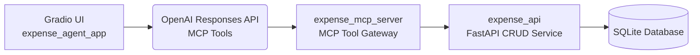

# 🚀 **ExpensesMCP**

### Agentic Expense Management with MCP, FastAPI, SQLite & Gradio

[]()
[]()
[]()
[]()
[](LICENSE)

---

## 📘 Overview

**ExpensesMCP** is a multi-container, agent-driven expense-tracking system that demonstrates how **OpenAI MCP tools**, **FastAPI microservices**, **Gradio UI**, and **SQLite** can be combined into a secure, extensible, LLM-powered application.

With ExpensesMCP, users can interact naturally:

* “Add a $20 lunch expense”
* “List all expenses from this week”
* “Update expense 3 to $14”
* “Delete the taxi ride”

The underlying AI agent uses **MCP tools** to safely perform structured operations on a backend API.

---

## 🧱 Architecture

### **System Flow**

```
Gradio UI → OpenAI Agent → MCP Server → Expense API → SQLite DB
```

### **Mermaid Diagram**



---

## 🧩 Components

### **1. `expense_agent_app` – Gradio + OpenAI Agent**

* Chat UI built using **Gradio Blocks**
* Uses OpenAI’s **Responses API** and **MCP tools**
* Stateless container; easy to scale
* Runs on **port 7860**

### **2. `expense_mcp_server` – MCP Tool Gateway**

* Exposes safe, typed MCP tool endpoints:

  * `add_expense`
  * `list_expenses`
  * `get_expense`
  * `update_expense`
  * `delete_expense`
* Forwards tool requests to the API container
* Runs on **port 8000**

### **3. `expense_api` – FastAPI + SQLite Backend**

* CRUD operations for expenses:

  * `POST /expenses`
  * `GET /expenses`
  * `GET /expenses/{id}`
  * `PUT /expenses/{id}`
  * `DELETE /expenses/{id}`
* Persisted using simple SQLite storage
* Runs on **port 9000**

---

## 📂 Folder Structure

```
expenses-mcp/
│
├── expense_api/              # FastAPI CRUD backend
│   ├── main.py
│   ├── db.py
│   ├── repository.py
│   └── Dockerfile
│
├── expense_mcp_server/       # MCP tools proxy
│   ├── main.py
│   ├── config.py
│   └── Dockerfile
│
├── expense_agent_app/        # Gradio UI + OpenAI SDK
│   ├── client.py
│   ├── mcp_client.py
│   └── Dockerfile
│
├── docker-compose.yml
└── README.md
```

---

## 🚀 Quickstart

### **1. Clone the repo**

```bash
git clone https://github.com/ganapathyp/expenses-mcp.git
cd expenses-mcp
```

### **2. Set your OpenAI API Key**

```bash
export OPENAI_API_KEY=sk-...
```

(Windows PowerShell)

```powershell
setx OPENAI_API_KEY "sk-..."
```

### **3. Launch the full multi-container environment**

```bash
docker compose up --build
```

You will now have:

| Component             | URL                                                      | Description          |
| --------------------- | -------------------------------------------------------- | -------------------- |
| **API**               | [http://localhost:9000/docs](http://localhost:9000/docs) | Expense CRUD backend |
| **MCP Server**        | [http://localhost:8000/docs](http://localhost:8000/docs) | MCP tool gateway     |
| **Agent UI (Gradio)** | [http://localhost:7860](http://localhost:7860)           | Interactive chatbot  |

---

# 🧪 Example Commands (Chat with Agent)

Try these inside the Gradio UI:

* **“Add a $12 lunch expense in food category”**
* **“List all expenses”**
* **“Update expense 1 to amount $18”**
* **“Delete expense 3”**

---

# 🏗 Deployment Notes

### ✔ Microservice boundaries

Each service is independently deployable via Docker.

### ✔ Scaling

* API and MCP server can scale horizontally behind a load balancer.
* Gradio UI can scale as stateless frontend workers.

### ✔ Database

SQLite used for portability—easy to swap with Postgres.

---

# 🔧 Future Enhancements

* 🔐 API & MCP authentication
* 📊 Dashboard visualization of expenses (Plotly, Gradio Charts)
* 🧮 Monthly budget tracking & summaries
* 📁 CSV import/export
* ☁️ Terraform + cloud deployment examples

---

